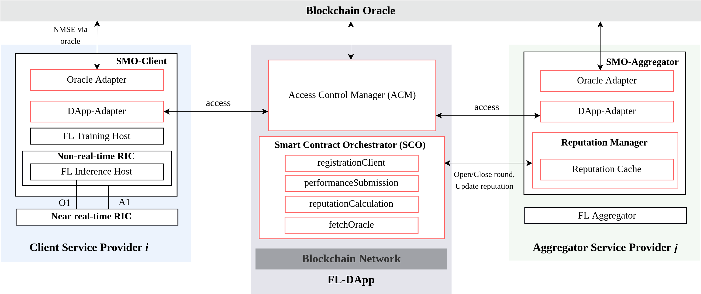
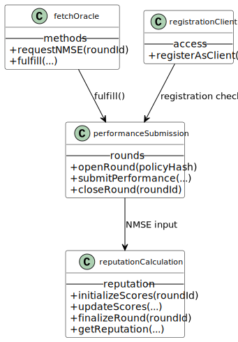
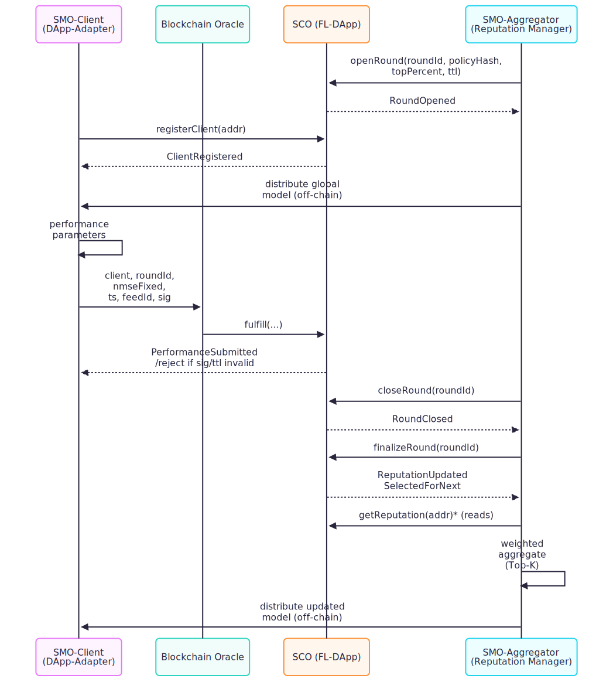

# FL-DApp: Open-Source Decentralized Application for Reputation in O-RAN Federated Learning



## Abstract
This artifact implements a lightweight, auditable reputation layer for multi-operator Federated Learning (FL) in O-RAN. The design follows a *minimal on-chain, maximal off-chain* principle: smart contracts expose a round-scoped interface for registering participants and ingesting oracle-signed performance metrics (NMSE, fixed-point), while an off-chain Reputation Manager computes per-client reputation and commits a single batched update per round. The reference deployment targets Polygon Amoy and is portable to any EVM-compatible network.

This work is supported by the UNITY-6G project, funded from the European Union’s Horizon Europe Smart Networks and Services Joint Undertaking (SNS JU) research and innovation programme under the Grant Agreement No 101192650. Also from Spain’s national R&D programmes through ANEMONE (PID2021-126431OB-I00), funded by MCIN/AEI/10.13039/501100011033 and by “ERDF A way of making Europe”; 6G-TENET (PID2024-160874OB-I00), funded by MICIU/AEI/10.13039/501100011033 and by ERDF, EU; and the 6G-DAWN ELASTIC (TSI-063000-2021-54/55) funded by Spanish MINECO.

## System Overview

**Key Components**
- **SMO-Client (CLSP):** trains/infers locally and exposes  
  - *Oracle Adapter (Chainlink adapter)* — signs the latest NMSE;  
  - *DApp Adapter* — handles registration, nonce/gas, retries.
- **Blockchain layer:**  
  - *Access Control Manager (ACM)* — role gating (Client/Aggregator);  
  - *Smart Contract Orchestrator (SCO)* — `openRound`, `submitNMSE`, `closeRound`, `finalizeRound`, `getReputation`.
- **SMO-Aggregator (AGSP):** listens for submissions, computes reputations, commits a *round snapshot*, and selects clients for the next iteration.

---

## Architecture Diagrams

### Class Diagram
<div align="center">
  
</div>

---

### Sequence Diagram
<div align="center">
  
</div>

## Installation and Running Instructions Using Hardhat

### Prerequisites

- Node.js installed (version 18.x or later)
- A personal Ethereum wallet (e.g., MetaMask)

### Setup

1. **Clone the repository:**
   ```bash
   git clone <repository-url>
   cd <repository-directory>
   ```

2. **Install dependencies:**
   ```bash
   npm install
   ```

3. **Create a `.env` file:**
   Add your Ethereum wallet private key and Alchemy/Polygon node URL:
   ```ini
   # .env
   PRIVATE_KEY="0x<your_pk>"
   ALCHEMY_RPC_URL="https://polygon-amoy.g.alchemy.com/v2/<YOUR_KEY>"
   CHAIN_ID=80002
   REG_ADDRESS="0x<registrationClient>"   # after deploy
   SCO_ADDRESS="0x<SCO>"                  # after deploy
   ```

### Common Hardhat Commands

- **Compile contracts:**
  ```bash
  npx hardhat compile
  ```
  This compiles the smart contracts and checks for any syntax errors.

- **Run tests:**
  ```bash
  npx hardhat test
  ```
  Execute unit tests for the contracts to ensure correct behavior.

- **Deploy contracts:**
  ```bash
  npx hardhat run scripts/deploy.js --network polygonAmoy
  ```
  Deploys the smart contracts to the **Polygon Amoy** testnet.

- **Interact with deployed contracts:**
  ```bash
  npx hardhat console --network polygonAmoy
  ```
  Provides an interactive console to interact with deployed contracts.

- **Verify contract on Polygonscan:**
  ```bash
  npx hardhat verify --network polygonAmoy DEPLOYED_CONTRACT_ADDRESS
  ```
  Verifies the source code of your deployed contract on Polygonscan.

### Deployment via Hardhat Ignition

If you want to use Hardhat Ignition for deployment:
```bash
npx hardhat ignition deploy ./ignition/modules/Lock.js
```
This command deploys modules using Hardhat Ignition, a plugin for advanced deployment scripts.


### Metrics & Telemetry
We include a sample Amoy run:

<div align="center">
  
</div>


- `docs/diagrams/app-metrics.png` — example Alchemy dashboard.
- `logs` — CSVs for registration, performance submissions, and reputation updates.

---
## Conclusion

This setup not only improves the robustness and efficiency of the O-RAN ecosystem but also enhances data security and user privacy through decentralized technologies. The integration of blockchain allows for a tamper-proof, transparent record-keeping system that significantly boosts the trustworthiness of the federated learning process within telecom networks.
